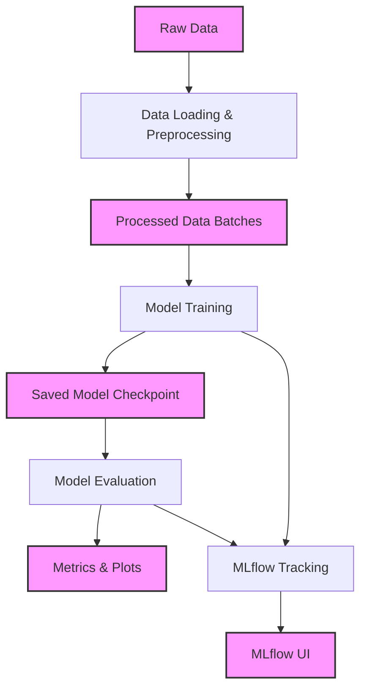

# Fashion MNIST Classifier: End-to-End Deep Learning Pipeline with MLOps

[](https://github.com/radixon/fashion-mnist-classifier/actions/workflows/ci.yml)
[](https://github.com/radixon/fashion-mnist-classifier/actions)
[](https://github.com/radixon/fashion-mnist-classifier/actions)
[](https://opensource.org/licenses/MIT)
[](https://pytorch.org/)

A comprehensive MLOps project implementing a Fashion MNIST classifier using PyTorch, featuring ensemble modeling, Docker deployment, REST API, and complete CI/CD pipeline.

## Project Description

This project demonstrates end-to-end machine learning engineering skills through a complete Fashion MNIST classification pipeline. Development showcases modern MLOps practices, clean code architecture, and production-ready deployment strategies.


## Table of Contents

1.  [Features](#features)
2.  [Key Results](#key-results)
3.  [Architecture Overview](#architecture-overview)
4.  [Dataset](#dataset)
5.  [Technologies](#technologies)
6.  [Installation](#installation)
7.  [Usage](#usage)
8.  [API Reference](#api-reference)
9.  [Project Structure](#project-structure)
10.  [MLOps & Experiment Tracking](#mlops--experiment-tracking)
11. [License](#license)

## Features

*   **Advanced Deep Learning Models:** Implements and experiments with various Convolutional Neural Network (CNN) architectures, including a `VanillaCNN` for baseline and a `DeepCNN` incorporating Batch Normalization and Dropout for improved performance and regularization.
*   **Efficient PyTorch Data Pipeline:** Leverages `torchvision.datasets` and `torch.utils.data.DataLoader` for streamlined data acquisition, preprocessing (normalization, tensor conversion), batching, and shuffling.
*   **Configurable Training & Evaluation:** Utilizes a centralized `config.yaml` for managing all hyperparameters, model architectures, and file paths, ensuring high reproducibility and easy experimentation.
*   **Robust Training Management:** Encapsulates the core PyTorch training and validation loops (`ModelTrainer`), handling crucial model state changes (`model.train()`, `model.eval()`).
*   **Comprehensive Evaluation & Visualization:** Provides tools for calculating key performance metrics (accuracy, precision, recall, F1-score) and generates insightful plots (confusion matrices, training history, sample predictions).
*   **Structured Logging:** Implements a sophisticated logging system that directs messages to both the console and timestamped log files, crucial for debugging, monitoring, and auditing training runs.
*   **Experiment Tracking with MLflow:** Fully integrates MLflow to automatically log parameters, epoch-wise metrics, and model artifacts for systematic experiment comparison and management.
*   **Exploratory Data Analysis (EDA):** Dedicated Jupyter Notebook for in-depth data understanding, visualization of sample images, and analysis of class distributions.
*   **Rapid Experimentation:** Jupyter Notebook for quick training runs and interactive analysis of baseline model performance.
*   **Modular Project Structure:** Organized into logical directories and Python packages (`src/`, `data/`, `configs/`, `scripts/`, `models/`, `results/`, `notebooks/`) for clear separation of concerns.
*   **Version Control:** Managed with Git and includes a `.gitignore` for a clean repository.

## Key Results

*   **Model Performance:** The `DeepCNN` model, leveraging Batch Normalization and Dropout, consistently achieves higher validation accuracy **~93%** after 10 epochs compared to the `VanillaCNN` **~91%**.
*   **Experiment Tracking:** Over **15** unique experiment runs have been logged and can be compared using the MLflow UI, demonstrating efficient hyperparameter tuning and model selection.
*   **Reproducibility:** All training runs are fully reproducible, with parameters, metrics, and models versioned in MLflow.

## Architecture Overview

The project follows a modular and layered architecture:




## Dataset

The project uses the Fashion MNIST dataset.  The dataset consists of 70,000 grayscale images categorized into 10 classes of fashion articles.

## Technologies

* Framework: PyTorch 2.0+
* Experiment Tracking: MLflow
* Web Framework: Streamlit, Flask
* Containerization: Docker, Docker Compose
* CI/CD: GitHub Actions
* Testing: PyTest
* Configuration: YAML configuration management
* Documentation: MkDocs

## Installation

### 1. Clone Repo

```bash
git clone https://github.com/radixon/fashion-mnist-classifier.git
cd fashion-mnist-classifier
```

### 2. [Optional] Create and Activate a Virtual Environment
```bash
python3 -m venv .venv
source .venv/bin/activate
```

### 3. Install Dependencies
```bash
pip install -e
pip install -r requirements.txt
```

## Usage

### Train Models

- Train VanillaCNN (set model.name to 'VanillaCNN' in config.yaml)
```bash
python3 scripts/train.py
```

- Train DeepCNN (set model.name to 'DeepCNN' in config.yaml)
```bash
python3 scripts/train.py
```

- Train FashionResNet (set model.name to 'FashionResNet in config.yaml)
```bash
python3 scripts/train.py
```

### Evaluate Trained Models

- Evaluate VanillaCNN (set model.name to 'VanillaCNN' in config.yaml)
```bash
python3 scripts/evaluate.py
```

- Evaluate DeepCNN (set model.name to 'DeepCNN' in config.yaml)
```bash
python3 scripts/evaluate.py
```

- Evaluate FashionResNet (set model.name to 'FashionResNet' in config.yaml)
```bash
python3 scripts/evaluate.py
```

- Evaluate Ensemble (set model.name to 'Evaluate' in config.yaml)
```bash
python3 scripts/evaluate.py
```

### Web Application

- Run streamlit web app
***Access*** http://localhost:8501
```
streamlit run app/streamlit_app.py
```

### REST API

***API endpoints*** http://localhost:5000
```
python3 app/flask_app.py
```

### Docker Deployment

- Deploy Both Applications
```
docker compose -f docker/docker-compose.yml up -d
```

## API Reference

***Flask API Endpoints***
*   'GET /health' - Health Check
*   'POST /predict' - Image Classification
*   'GET /model-info'   - Model Information
*   'GET /' - API Documentation

## Project Structure
```
fashion-mnist-classifier/ 
├── .git/                     # Git version control metadata
├── .venv/                    # Python virtual environment
├── configs/                  # Configuration files for the project
│   └── config.yaml           # Main configuration for data, training, model, and paths
├── data/                     # Stores all project data
│   ├── raw/                  # Original, raw dataset files (downloaded by torchvision)
│   │   └── FashionMNIST/     # (Contains the actual .gz data files)
│   │       └── raw/
│   │       └── processed/    # (Used by torchvision for some datasets, but empty for F-MNIST)
│   ├── processed/            # For cleaned/transformed data (currently empty)
│   └── external/             # For external/supplementary data (currently empty)
├── mlruns/                   # MLflow tracking data (ignored by Git)
├── notebooks/                # Jupyter Notebooks for exploration and experimentation
│   ├── 01_data_exploration.ipynb # In-depth EDA of the Fashion MNIST dataset
│   └── 02_baseline_models.ipynb  # Rapid experimentation with baseline models
│   ├── 03_advanced_models.ipynb  # Tuning advanced models' hyperparameters
│   └── 04_model_comparison.ipynb # Analyze and compare models using models logged to MLflow
├── scripts/                  # Executable Python scripts for various tasks
│   ├── train.py              # Main script to train the model
│   └── evaluate.py           # Script to evaluate a trained model
├── docker/                   # Docker configuration
│   ├── Dockerfile            # Container definition
│   ├── .dockerignore         # Docker ignore rules
│   ├── build.sh              # Docker build script
│   ├── run_training.sh       # Training in container
│   ├── run_evaluation.sh     # Evaluation in container
│   ├── run_prediction.sh     # Prediction in container
│   └── docker-compose.yml    # Multi-service orchestration
├── src/                      # Source code for the project
│   ├── __init__.py           # Marks 'src' as a Python package
│   ├── data/                 # Data loading and preprocessing modules
│   │   ├── __init__.py       # Marks 'src/data' as a Python sub-package
│   │   ├── data_loader.py    # Functions to load datasets and create DataLoaders
│   │   └── preprocessing.py  # Defines image transformations (ToTensor, Normalize)
│   ├── evaluation/           # Modules for model evaluation and visualization
│   │   ├── __init__.py       # Marks 'src/evaluation' as a Python sub-package
│   │   ├── evaluator.py      # Core logic for calculating metrics
│   │   └── visualization.py  # Functions for plotting results (e.g., confusion matrix)
│   ├── model/                # Neural network model definitions
│   │   ├── __init__.py       # Marks 'src/model' as a Python sub-package
│   │   ├── base_model.py     # Abstract base class for all models
│   │   └── cnn_models.py     # SimpleCNN and DeepCNN implementations
│   ├── training/             # Modules for training logic
│   │   ├── __init__.py       # Marks 'src/training' as a Python sub-package
│   │   └── trainer.py        # Manages the training and validation loops
│   └── utils/                # General utility functions
│       ├── __init__.py       # Marks 'src/utils' as a Python sub-package
│       ├── config.py         # Handles loading configuration from YAML
│       ├── helpers.py        # General helper functions (e.g., timestamp, class names)
│       └── logger.py         # Centralized logging setup
├── tests/                    # Unit Tests
├── .gitignore                # Specifies files/folders to be ignored by Git
├── LICENSE                   # Project's license (e.g., MIT)
├── README.md                 # Project overview and documentation
├── requirements.txt          # Python dependencies
└── setup.py                  # Project packaging configuration
```

## MLOps & Experiment Tracking

- Configuration Management: All parameters are in config.yaml for reproducibility
- Structured Logging: logs generated to aid in debugging
- Experiment Tracking: MLflow integrated to record and compare each experiment run

## License
This project is licensed under the [MIT License](LICENSE).

